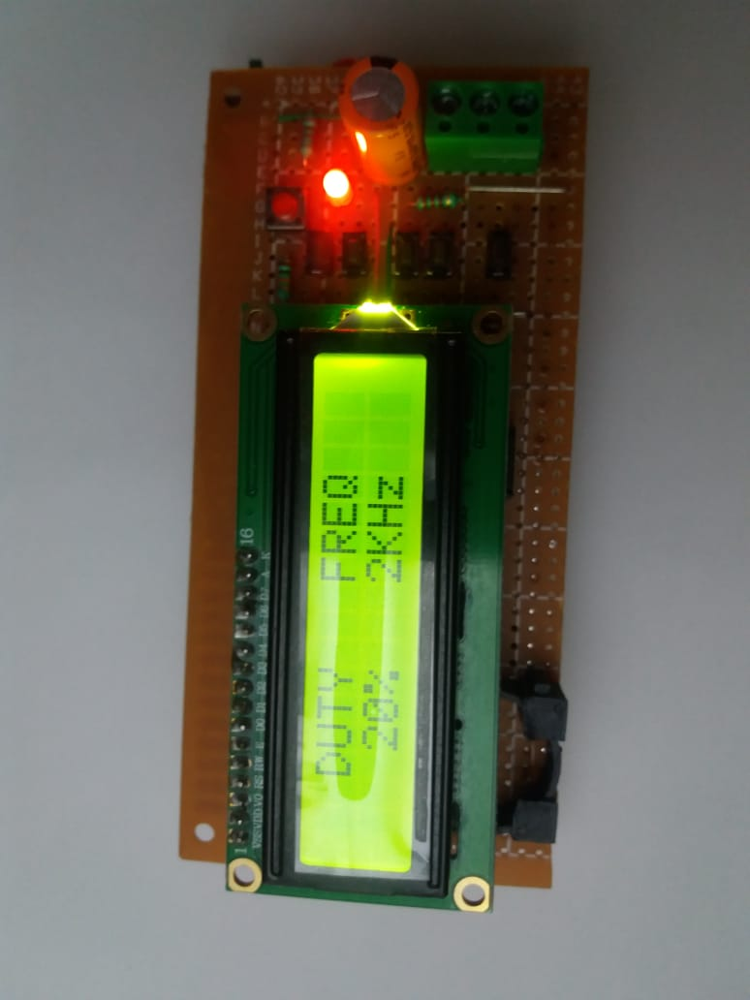

# atmega-328-function-generator-and-osciloscope

This is very basic DIY frequency generator with variable duty cycle and frequency based square wave generator and oled osciloscope. It has capabilty to adjust the frequency from 1Khz-100Khz and with adjustable duty cycle 0% - 100%. The adjustment can be done by few buttons.there are 5 sets of buttons which are -
1. PWM UP , 2. PWM DOWN, 3. FREQUENCY UP, 4.FREQUENCY DOWN, 5.SELECT.
One additional reset button is provided with the circuit to reset the whole circuit.

https://drive.google.com/file/d/1GcBSnrcg3rcdihNIH0e927Y0qLVxMHoq/view?usp=sharing

