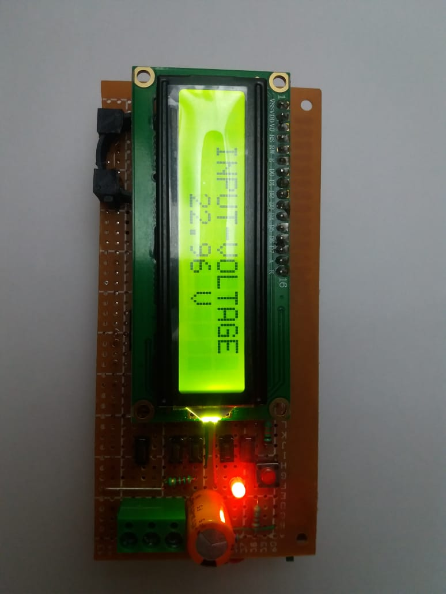

# atmega-328-function-generator-and-osciloscope

This is very basic DIY frequency generator with variable duty cycle and frequency based square wave generator and oled osciloscope. It has capabilty to adjust the frequency from 1Khz-100Khz and with adjustable duty cycle 0% - 100%. It has also integrated voltmeter which can read upto 55V DC .The adjustment can be done by few buttons.there are 5 sets of buttons which are -
1. PWM UP , 2. PWM DOWN, 3. FREQUENCY UP, 4.FREQUENCY DOWN, 5.MODE SELECT.
One additional reset button is provided with the circuit to reset the whole circuit.

WORKING :

At first when the FG start it by defult mode and voltmeter is turned on . the output port voltmeter can connect 0V shows O.00V and output connect 5V shows 55V then voltmeter system are working perfectly. Now pressed MODE SELECT button and the system enter into FG (frequency generator) mode. intialy freq and duty cycle are in 0 selection. in press the freq up button and frequency of the output square wave get increased by 1khz,2khz,3Khz and so on upto 100Khz. again pressed duty up increase by 10% every time upto 100%. By presseing freq down and duty down any time you can decrease the frequency and duty cycle.

https://drive.google.com/file/d/1GcBSnrcg3rcdihNIH0e927Y0qLVxMHoq/view?usp=sharing

